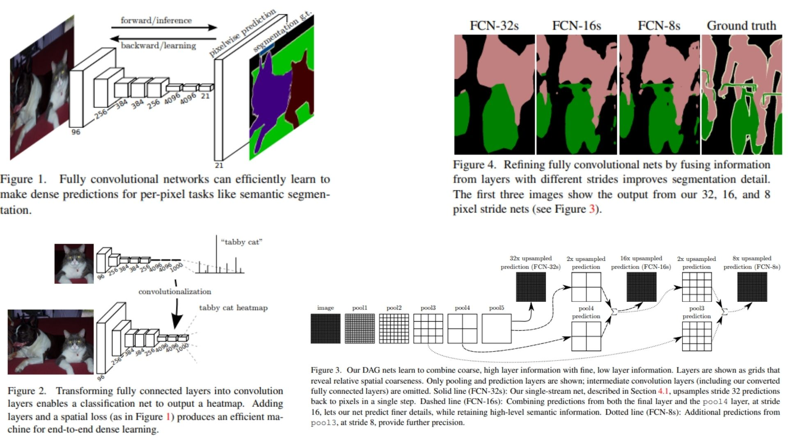

# 🌐 FCN-Replication — Fully Convolutional Networks for Semantic Segmentation

This repository provides a **faithful Python replication** of the **Fully Convolutional Networks (FCN)** framework for **end-to-end semantic segmentation**. The implementation follows the original paper pipeline, including **conversion of fully connected layers to convolutions, learnable deconvolution-based upsampling, and multi-level skip fusion (FCN-32s / 16s / 8s)**.

Paper reference: *Fully Convolutional Networks for Semantic Segmentation (Long et al., 2015)*  https://arxiv.org/abs/1411.4038

---

## Overview 🜁



> The model converts a **classification network (VGG16)** into a **dense prediction network**, producing coarse semantic maps that are progressively refined using **learnable upsampling and skip connections from intermediate feature layers**.

---

### Key Concepts

- **Input image**

$$
x \in \mathbb{R}^{H \times W \times 3}
$$

- **Fully convolutional transformation**

Fully connected layers are reinterpreted as convolutions:

$$
\text{FC layer} \Rightarrow 1 \times 1 \text{ or } k \times k \text{ convolution}
$$

This allows the network to operate on **arbitrary image sizes**.


- **Score maps (class predictions)**

At each spatial location:

$$
s_{ij} = f(x)_{ij} \in \mathbb{R}^{C}
$$

where \( C \) is the number of classes.


- **Learnable upsampling (deconvolution)**

Coarse predictions are upsampled using transpose convolution:

$$
\hat{s} = \text{Deconv}(s)
$$

This corresponds to **fractional-stride convolution** and is initialized with **bilinear interpolation**.


- **Skip fusion (multi-scale refinement)**

Features from deeper and shallower layers are combined:

$$
f_{\text{fusion}} = f_{\text{upsampled}} + f_{\text{skip}}
$$

This merges:

- semantic information (deep layers)
- spatial detail (shallow layers)


- **Final dense prediction**

$$
y = \text{Upsample}(f_{\text{fusion}})
$$

resulting in **pixel-wise class logits**.

---

## Why FCN Matters 🜂

- Enables **dense prediction over arbitrary image resolution**
- Introduces **learnable upsampling instead of fixed interpolation**
- Uses **skip connections to recover spatial detail lost in deep layers**

---

## Repository Structure 🏗️

```
FCN-Replication/
├── src/
│   │
│   ├── blocks/
│   │   ├── conv_block.py        # conv + ReLU (VGG-style)
│   │   ├── fc_to_conv.py        # FC → Conv dönüşümü
│   │   ├── score_layer.py       # 1x1 conv (class scores)
│   │   ├── upsampling.py        # deconv (transpose conv)
│   │   └── skip_fusion.py       # element-wise sum (skip connection)
│   │
│   ├── backbone/
│   │   └── vgg16_fcn.py         # VGG16 → fully conv (pool1–pool5)
│   │
│   ├── model/
│   │   └── fcn8s.py             # FINAL MODEL (FCN-8s)
│   │
│   ├── head/
│   │   └── segmentation_head.py # final pixel-wise output
│   │
│   └── config.py                # num_classes, channels
│
├── images/
│   └── figmix.jpg               # FCN-32s / 16s / 8s diagram (makaledeki Fig.3-4 mantığı)
│
├── requirements.txt
└── README.md
```

---

## 🔗 Feedback

For questions or feedback, contact:  
[barkin.adiguzel@gmail.com](mailto:barkin.adiguzel@gmail.com)
